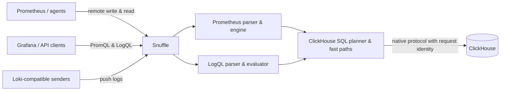

# Snuffle

**PromQL and LogQL APIs for telemetry stored in ClickHouse.**

> Keep ClickHouse as your storage engine. Keep the Prometheus and Loki APIs
> your tools already understand. Avoid operating a second telemetry database
> just to bridge the two.

Snuffle is a Go service that sits between observability clients and
ClickHouse. It accepts Prometheus remote write and read, PromQL queries, Loki
pushes, and LogQL queries, then translates that work into ClickHouse-native
reads and writes.

It is useful when your metrics or logs belong in ClickHouse, but your users,
dashboards, and agents expect Prometheus- or Loki-compatible APIs rather than
SQL.

## Why Snuffle?

ClickHouse is a strong fit for high-volume analytical data, but most
observability tooling speaks PromQL, LogQL, Prometheus remote storage, or the
Loki HTTP API. Without a bridge, teams usually have to choose between:

- duplicating telemetry into a separate Prometheus or Loki deployment;
- replacing familiar dashboards and query workflows with ClickHouse SQL; or
- building and maintaining protocol adapters in every producer and consumer.

Snuffle provides one focused compatibility layer instead.

| What you need | What Snuffle provides |
| --- | --- |
| Standard observability clients | Prometheus-compatible query, metadata, remote write, and remote read endpoints, plus Loki-compatible push and query endpoints |
| PromQL behavior users recognize | The upstream Prometheus parser and evaluation engine, including functions, aggregations, binary matching, subqueries, `@`, and `offset` |
| ClickHouse-scale execution | SQL pruning and pushdowns for common selectors, range queries, and aggregations so less data crosses into Go |
| One backend for metrics and logs | Purpose-built Snuffle schemas or compatibility with PostHog-style ClickHouse tables |
| Tenant isolation | A tenant is resolved per request and included in every ClickHouse data query |
| One authentication source of truth | Incoming HTTP Basic credentials are passed to ClickHouse; Snuffle does not maintain its own users or passwords |
| Encryption for client traffic | Optional inbound TLS with a supplied certificate or an automatically generated self-signed certificate |
| Operational visibility | Health, readiness, Prometheus metrics, structured query logs, and optional pprof endpoints |

## How it fits



Snuffle is the API and query layer, not another durable store. ClickHouse owns
the data, authentication policy, grants, replication, retention, and storage
operations.

### A good fit when

- telemetry is already in ClickHouse, or you want ClickHouse to become its
  primary store;
- existing tools must continue using Prometheus or Loki APIs;
- high-cardinality queries need database-side pruning and aggregation;
- metrics and logs need the same tenant boundary and operational model; or
- you want ClickHouse users and grants to control query access directly.

### Know the boundaries

Snuffle is not a full Prometheus or Loki server:

- it does not scrape targets, run service discovery, or evaluate recording and
  alerting rules;
- `/api/v1/rules` and `/api/v1/alerts` are compatibility stubs;
- streamed chunk responses for Prometheus remote read are not implemented;
- LogQL support is broad but not complete—see [LogQL support](#logql-support);
- duplicate remote-write retries are not deduplicated in the float sample
  table; and
- float samples and native histograms are snapped to 15-second buckets by
  default. Set `REMOTE_WRITE_SAMPLE_INTERVAL=0` to preserve incoming
  timestamps.

## Quick start

You need Go 1.26.1 or newer and Docker with Compose.

### 1. Start ClickHouse

```bash
docker compose up -d clickhouse
```

### 2. Create the default metrics and logs schemas

> [!WARNING]
> The schema scripts drop and recreate their named tables. Use an empty
> database for the quick start, and review the SQL before applying it to an
> existing deployment.

```bash
docker exec -i snuffle-clickhouse clickhouse-client --multiquery \
  < scripts/create_metrics_schema.sql

docker exec -i snuffle-clickhouse clickhouse-client --multiquery \
  < scripts/create_logs_snuffle_schema.sql
```

These scripts create the Snuffle-native layouts. Existing PostHog-style
tables are also supported; see [Storage layouts](#storage-layouts).

### 3. Run Snuffle

```bash
go run ./cmd/snuffle
```

Snuffle listens on `0.0.0.0:9091` and connects to
`localhost:9000/default` by default.

### 4. Check it

```bash
curl http://localhost:9091/-/ready

curl --get http://localhost:9091/api/v1/query \
  --data-urlencode 'query=vector(1)'
```

The service is now ready for Prometheus remote write, Prometheus-compatible
queries, Loki pushes, and LogQL queries.

## Connect existing tools

### Prometheus remote storage

Use Snuffle as a remote write and remote read target:

```yaml
remote_write:
  - url: https://snuffle.example.com/api/v1/write
    basic_auth:
      username: observability_writer
      password_file: /run/secrets/clickhouse_writer_password

remote_read:
  - url: https://snuffle.example.com/api/v1/read
    read_recent: true
    basic_auth:
      username: observability_reader
      password_file: /run/secrets/clickhouse_reader_password
```

Those usernames and passwords must be ClickHouse credentials. Snuffle passes
them through; it does not keep a separate user database.

### Grafana

Create a Prometheus data source whose URL is the Snuffle base URL for metrics.
Create a Loki data source using the same base URL for logs. Configure Basic
authentication with a ClickHouse user that has the required table grants.

### Direct PromQL

```bash
curl --user reader:password \
  --get https://snuffle.example.com/api/v1/query \
  --data-urlencode 'query=topk(5, rate(http_requests_total[5m]))'
```

### Direct LogQL

```bash
curl --user reader:password \
  --get https://snuffle.example.com/loki/api/v1/query_range \
  --data-urlencode 'query={service_name="api"} |= "error"' \
  --data-urlencode 'start=1700100060000000000' \
  --data-urlencode 'end=1700100360000000000' \
  --data-urlencode 'limit=100'
```

## Security model

### ClickHouse authentication pass-through

Every incoming HTTP request that accesses ClickHouse gets a request-scoped
native connection pool using that request's HTTP Basic username and password.
ClickHouse performs authentication and authorization; Snuffle does not
maintain a user database or make authentication decisions.

Requests without a decodable Basic Authorization header connect as
ClickHouse's `default` user by default. During a staged rollout, set
`SNUFFLE_ALLOW_UNAUTHENTICATED=true` to allow requests without credentials by
using `CH_USER` and `CH_PASSWORD`. Credentials that are present—including a
blank password—are always passed through unchanged and never replaced after
ClickHouse rejects them.

Outside that optional fallback, `CH_USER` and `CH_PASSWORD` are only used for
Snuffle-initiated work such as downstream self-scraping.

Use TLS whenever Basic credentials cross an untrusted network.

### Incoming TLS

Enable HTTPS with an in-memory self-signed certificate:

```bash
SNUFFLE_TLS_ENABLED=true go run ./cmd/snuffle
```

The generated certificate is valid for one year and is recreated whenever
Snuffle restarts. It is convenient for development, but clients must trust it
explicitly.

For a stable production identity, provide a PEM certificate and private key:

```bash
SNUFFLE_TLS_CERT_FILE=/etc/snuffle/tls.crt \
SNUFFLE_TLS_KEY_FILE=/etc/snuffle/tls.key \
go run ./cmd/snuffle
```

Providing the certificate paths enables TLS automatically unless
`SNUFFLE_TLS_ENABLED=false` is explicitly set. Both files are required, and
Snuffle fails at startup if the pair cannot be loaded. These settings protect
client-to-Snuffle traffic only; they do not change the native connection from
Snuffle to ClickHouse.

### Multi-tenancy

Snuffle resolves a numeric team ID in this order:

1. `/t/{team_id}/...` or `/team/{team_id}/...` in the request path;
2. the configured tenant header, `X-Team-ID` by default;
3. the configured query parameter, `team_id` by default; then
4. `SNUFFLE_DEFAULT_TEAM_ID`, default `0`.

Examples:

```bash
curl --header 'X-Team-ID: 42' \
  --get http://localhost:9091/api/v1/query \
  --data-urlencode 'query=up'

curl --get http://localhost:9091/t/42/api/v1/query \
  --data-urlencode 'query=up'
```

Every ClickHouse query against series, labels, samples, histograms, exemplars,
metadata, or logs includes the resolved tenant filter.

## API compatibility

### Prometheus-compatible API

| Capability | Endpoints |
| --- | --- |
| Instant and range queries | `GET\|POST /api/v1/query`, `GET\|POST /api/v1/query_range` |
| Labels and series | `GET\|POST /api/v1/labels`, `/api/v1/label/<name>/values`, `/api/v1/series` |
| Metadata and exemplars | `GET\|POST /api/v1/metadata`, `/api/v1/query_exemplars` |
| Remote storage | `POST /api/v1/write`, `POST /api/v1/read` |
| Compatibility stubs | `GET\|POST /api/v1/rules`, `/api/v1/alerts` |

PromQL compatibility comes from Prometheus's own parser and evaluation engine,
not a local grammar clone. The storage layer supports float samples, native
histograms, exemplars, and metric metadata.

### Loki-compatible API

| Capability | Endpoints |
| --- | --- |
| Log ingestion | `POST /loki/api/v1/push` |
| Instant and range queries | `GET\|POST /loki/api/v1/query`, `GET\|POST /loki/api/v1/query_range` |
| Labels and series | `GET\|POST /loki/api/v1/labels`, `/loki/api/v1/label/<name>/values`, `/loki/api/v1/series` |
| Index and build information | `GET /loki/api/v1/index/stats`, `GET /loki/api/v1/status/buildinfo` |

### LogQL support

Supported LogQL features include:

- stream selectors and line filters;
- label filters;
- `json`, `logfmt`, `regexp`, and `pattern` parsers;
- `line_format`, `label_format`, and `drop` pipeline stages;
- `unwrap`;
- range aggregations such as `count_over_time` and `rate`;
- simple vector aggregations; and
- `topk` and `bottomk`.

## Storage layouts

Metrics and logs choose their layouts independently.

| Data | Layout | Best for | Schema |
| --- | --- | --- | --- |
| Metrics | `current` (default) | New Snuffle deployments optimized around Prometheus series, samples, labels, histograms, exemplars, and metadata | [`scripts/create_metrics_schema.sql`](scripts/create_metrics_schema.sql) |
| Metrics | `posthog` | Existing PostHog-style `metrics`/`metrics1` and `metric_attributes` tables | [`scripts/create_metrics_posthog_schema.sql`](scripts/create_metrics_posthog_schema.sql) |
| Logs | `snuffle` (default with `current` metrics) | New deployments with a narrow log table, stream dictionary, label index, and minute rollups | [`scripts/create_logs_snuffle_schema.sql`](scripts/create_logs_snuffle_schema.sql) |
| Logs | `posthog` (default with `posthog` metrics) | Existing PostHog-style `logs34` and `log_attributes2` tables | [`scripts/create_logs_posthog_schema.sql`](scripts/create_logs_posthog_schema.sql) |

### Snuffle-native metrics

The default metrics schema separates the hot paths:

- `metrics_series` stores series identity and full label JSON;
- `metrics_label_index` prunes arbitrary label matchers;
- `metrics_samples` stores float samples;
- `metrics_histograms` stores native histogram payloads;
- `metrics_exemplars` stores exemplar values and labels; and
- `metrics_metadata` stores metric type, unit, and help.

Hot columns are non-null. Label matching uses the index, while exact
Prometheus matcher semantics are checked in Go. ClickHouse does not need to
run `JSONExtract` over full label sets on the normal query path.

### Snuffle-native logs

The default log schema stores repeated stream metadata once:

- `logs` contains the timestamp, body, stream ID, expiry, and per-entry fields;
- `log_streams` contains stream labels and resource attributes;
- `log_stream_labels` supports label pruning; and
- `log_stream_stats` stores minute-level count and byte rollups.

Snuffle reconstructs the logical Loki label surface at query time. This keeps
the hot log table narrow while retaining selector and aggregation support.

### PostHog-compatible data

In PostHog metrics mode, Snuffle builds Prometheus labels from `metric_name`,
`service_name`, `resource_attributes`, and `attributes_map_str`, and computes
series identity in ClickHouse.

In PostHog logs mode, Loki stream labels and structured metadata map onto the
OpenTelemetry-shaped `logs34` columns. Service, severity, trace, span, resource,
and other attributes are promoted into their corresponding native or map
columns.

## Query execution

Snuffle uses the upstream Prometheus engine for correctness and ClickHouse
fast paths for query shapes that can be safely pushed down.

Important execution choices include:

- positive label filters are pruned through indexes before samples are read;
- instant selectors fetch only the latest sample in the lookback window;
- selective reads use exact series IDs, while broad reads use ClickHouse
  subqueries rather than oversized `IN (...)` lists;
- plain range selectors use ClickHouse time-series grid functions so Snuffle
  receives one row per series instead of one row per raw sample;
- safe `rate`, `irate`, `increase`, `delta`, and `idelta` range aggregations
  are executed server-side;
- safe instant aggregations such as `sum`, `avg`, `count`, `min`, `max`,
  `group`, `topk`, and `bottomk` are pushed down where possible;
- `/series` avoids loading samples; and
- remote write uses ClickHouse native protocol batches.

Snuffle does not call ClickHouse `prometheusQuery` or
`prometheusQueryRange`.

For schema design, benchmark methodology, query-shape details, and regression
workflows, see [PERFORMANCE.md](PERFORMANCE.md).

## Configuration

Snuffle is configured with environment variables.

### Server and security

| Variable | Default | Purpose |
| --- | --- | --- |
| `SIDECAR_HOST` | `0.0.0.0` | HTTP listen host |
| `SIDECAR_PORT` | `9091` | HTTP listen port |
| `SNUFFLE_TLS_ENABLED` | `false` | Enable incoming HTTPS; automatically true when a certificate path is configured |
| `SNUFFLE_TLS_CERT_FILE` | empty | PEM server certificate; omit with the key to generate a self-signed certificate |
| `SNUFFLE_TLS_KEY_FILE` | empty | PEM private key; required with the certificate |
| `SNUFFLE_PPROF` | `false` | Expose Go pprof handlers under `/debug/pprof/` |

### ClickHouse connection

| Variable | Default | Purpose |
| --- | --- | --- |
| `CH_ADDR` | `localhost:9000` | Native ClickHouse address; accepts a comma-separated replica list |
| `CH_DATABASE` | `default` | Database containing the configured tables |
| `CH_USER` | `default` | User for Snuffle-initiated work and optional request fallback |
| `CH_PASSWORD` | empty | Password for Snuffle-initiated work and optional request fallback |
| `SNUFFLE_ALLOW_UNAUTHENTICATED` | `false` | Allow requests without decodable Basic credentials by using `CH_USER` and `CH_PASSWORD` |
| `CH_TIMEOUT_SECONDS` | `30` | ClickHouse connection and operation timeout in seconds |

### Schema and tables

| Variable | Default | Purpose |
| --- | --- | --- |
| `CH_SCHEMA_LAYOUT` | `current` | Metrics layout: `current` or `posthog`; `SNUFFLE_SCHEMA_LAYOUT` is accepted as a legacy fallback |
| `CH_SERIES_TABLE` | `metrics_series` / empty | Series table; empty by default in PostHog mode |
| `CH_SAMPLES_TABLE` | `metrics_samples` / `metrics` | Float sample table or PostHog metrics view |
| `CH_LABEL_INDEX_TABLE` | `metrics_label_index` / empty | Metrics label index |
| `CH_ATTRIBUTE_TABLE` | `metric_attributes` | PostHog attribute discovery table |
| `CH_LABEL_POSTINGS_TABLE` | empty | Optional optimized metrics postings table |
| `CH_ACTIVITY_TABLE` | empty | Optional series-activity table |
| `CH_METRICS_TABLE` | `metrics_metadata` / empty | Metric metadata table |
| `CH_HISTOGRAMS_TABLE` | `metrics_histograms` / empty | Native histogram table |
| `CH_EXEMPLARS_TABLE` | `metrics_exemplars` / empty | Exemplar table |
| `CH_LOG_SCHEMA_LAYOUT` | derived | Logs layout: `snuffle` or `posthog`; follows the metrics layout by default |
| `CH_LOGS_TABLE` | `logs` / `logs34` | Log events table |
| `CH_LOG_STREAMS_TABLE` | `log_streams` / empty | Snuffle log stream dictionary |
| `CH_LOG_STREAM_LABELS_TABLE` | `log_stream_labels` / empty | Snuffle log label index |
| `CH_LOG_STREAM_STATS_TABLE` | `log_stream_stats` / empty | Snuffle log minute rollups |
| `CH_LOG_ATTRIBUTES_TABLE` | empty / `log_attributes2` | PostHog log attributes table; `CH_LOG_ATTRIBUTE_TABLE` is also accepted |

`CH_TAGS_TABLE` and `CH_DATA_TABLE` remain accepted as fallbacks for
`CH_SERIES_TABLE` and `CH_SAMPLES_TABLE`. `SNUFFLE_LOG_SCHEMA_LAYOUT` remains
accepted as a fallback for `CH_LOG_SCHEMA_LAYOUT`.

### Query and ingestion behavior

| Variable | Default | Purpose |
| --- | --- | --- |
| `PROMQL_QUERY_TIMEOUT_SECONDS` | `30` | PromQL and LogQL query timeout in seconds |
| `PROMQL_LOOKBACK_DELTA` | `5m` | PromQL lookback delta |
| `PROMQL_MAX_SAMPLES` | `50000000` | Prometheus engine sample limit |
| `CH_MAX_SERIES` | `1000000` | Maximum matching series selected from ClickHouse |
| `CH_ID_CHUNK_SIZE` | `20000` | Series ID batch size for selective reads |
| `CH_AGGREGATE_MAX_THREADS` | `1` | ClickHouse `max_threads` for pushed-down aggregations; `0` leaves the ClickHouse default |
| `REMOTE_WRITE_SAMPLE_INTERVAL` | `15s` | Timestamp bucket for float samples and histograms; `0` preserves timestamps |
| `SNUFFLE_SAMPLE_ATTRIBUTES` | layout-dependent | Store sample label maps in `attributes_map_str`; false for `current`, true for `posthog` |
| `SNUFFLE_LOG_RETENTION` | `720h` | Expiry assigned to log rows received through Loki push |
| `SNUFFLE_LOG_QUERY_MAX_ROWS` | `100000` | Maximum raw log rows read by a LogQL query |

### Tenancy and self-observability

| Variable | Default | Purpose |
| --- | --- | --- |
| `SNUFFLE_DEFAULT_TEAM_ID` | `0` | Tenant used when no path, header, or query tenant is provided |
| `SNUFFLE_TEAM_HEADER` | `X-Team-ID` | Tenant request header |
| `SNUFFLE_TEAM_QUERY_PARAM` | `team_id` | Tenant query parameter |
| `SNUFFLE_SELF_SCRAPE_ENABLED` | `true` | Write Snuffle's own metrics into the configured metrics tables |
| `SNUFFLE_SELF_SCRAPE_INTERVAL` | `15s` | Self-scrape interval; `0` disables downstream writes while keeping `/metrics` |
| `SNUFFLE_SELF_SCRAPE_TEAM_ID` | default team | Tenant for self-scraped metrics |
| `SNUFFLE_SELF_SCRAPE_JOB` | `snuffle` | `job` label for self-scraped metrics |
| `SNUFFLE_SELF_SCRAPE_INSTANCE` | `<hostname>:<port>` | `instance` label for self-scraped metrics |

## Operations

| Endpoint | Purpose |
| --- | --- |
| `GET /-/healthy` | Ping ClickHouse with the request's credentials |
| `GET /-/ready` | Same ClickHouse readiness check |
| `GET /metrics` | Snuffle, Go runtime, and process metrics in Prometheus text format |
| `/debug/pprof/*` | Go profiles when `SNUFFLE_PPROF=true` |

Snuffle records request duration, result sizes, ClickHouse query and insert
latency, rows and bytes processed, in-flight work, remote storage traffic, and
self-scrape health. Failed PromQL requests include structured query metadata
to make backend and query-shape failures diagnosable.

`/metrics` and pprof do not access ClickHouse, so ClickHouse authentication
does not protect them. Restrict those endpoints at the network or proxy layer
when Snuffle is exposed outside a trusted environment.

## Development and performance

Run the unit and package tests:

```bash
go test ./...
```

Run the Docker-backed integration suite:

```bash
./scripts/integration_test.sh
```

Run repeatable metrics and logs regression benchmarks:

```bash
make perf-test
```

PostHog-compatible layouts and the focused autoresearch target are available
separately:

```bash
make perf-test-posthog
make autoresearch-snuffle-metrics
```

Benchmark results are regression signals, not production capacity claims.
Latency and throughput depend on hardware, ClickHouse settings, part sizes,
cardinality, query mix, and merge load. See [PERFORMANCE.md](PERFORMANCE.md) for
the datasets, comparison math, artifacts, and runbook.

## License

Snuffle is licensed under the [Apache License 2.0](LICENSE).
